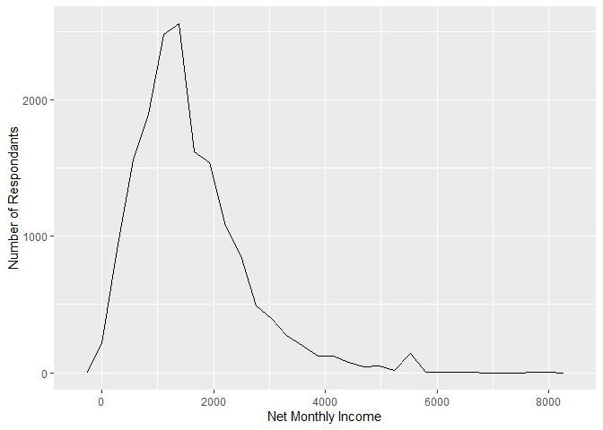
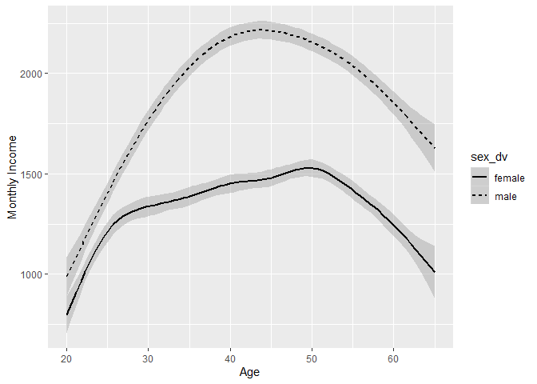
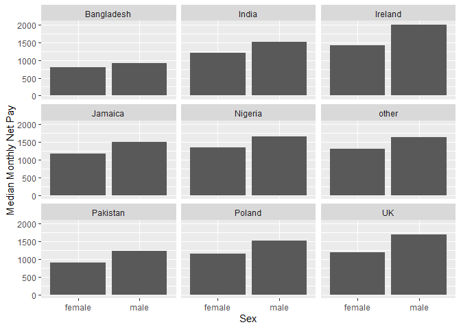
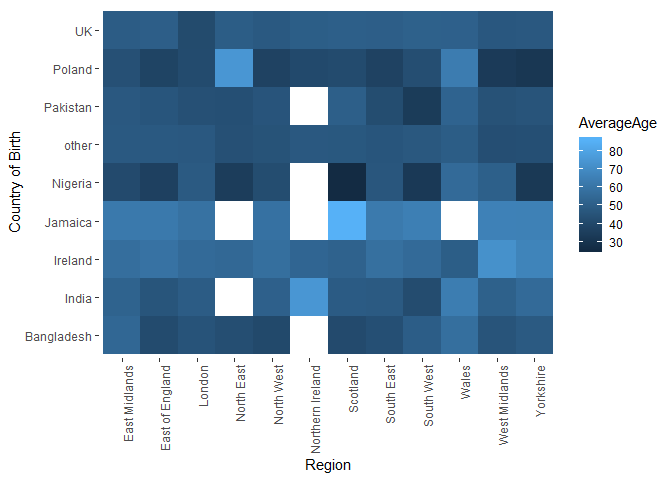
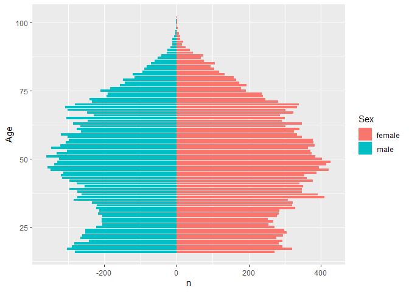

Statistical assignment 4
================
Andrew Bosbery
29/02/2020

In this assignment you will need to reproduce 5 ggplot graphs. I supply
graphs as images; you need to write the ggplot2 code to reproduce them
and knit and submit a Markdown document with the reproduced graphs (as
well as your .Rmd file).

First we will need to open and recode the data. I supply the code for
this; you only need to change the file paths.

    ```r
    library(tidyverse)
    Data8 <- read_tsv("C:/Users/Andrew/Documents/University/Year 2/Term 2/Data Analysis 3/Project/data/UKDA-6614-tab/tab/ukhls_w8/h_indresp.tab")
    Data8 <- Data8 %>%
        select(pidp, h_age_dv, h_payn_dv, h_gor_dv)
    Stable <- read_tsv("C:/Users/Andrew/Documents/University/Year 2/Term 2/Data Analysis 3/Project/data/UKDA-6614-tab/tab/ukhls_wx/xwavedat.tab")
    Stable <- Stable %>%
        select(pidp, sex_dv, ukborn, plbornc)
    Data <- Data8 %>% left_join(Stable, "pidp")
    rm(Data8, Stable)
    Data <- Data %>%
        mutate(sex_dv = ifelse(sex_dv == 1, "male",
                           ifelse(sex_dv == 2, "female", NA))) %>%
        mutate(h_payn_dv = ifelse(h_payn_dv < 0, NA, h_payn_dv)) %>%
        mutate(h_gor_dv = recode(h_gor_dv,
                         `-9` = NA_character_,
                         `1` = "North East",
                         `2` = "North West",
                         `3` = "Yorkshire",
                         `4` = "East Midlands",
                         `5` = "West Midlands",
                         `6` = "East of England",
                         `7` = "London",
                         `8` = "South East",
                         `9` = "South West",
                         `10` = "Wales",
                         `11` = "Scotland",
                         `12` = "Northern Ireland")) %>%
        mutate(placeBorn = case_when(
                ukborn  == -9 ~ NA_character_,
                ukborn < 5 ~ "UK",
                plbornc == 5 ~ "Ireland",
                plbornc == 18 ~ "India",
                plbornc == 19 ~ "Pakistan",
                plbornc == 20 ~ "Bangladesh",
                plbornc == 10 ~ "Poland",
                plbornc == 27 ~ "Jamaica",
                plbornc == 24 ~ "Nigeria",
                TRUE ~ "other")
        )
    ```

Reproduce the following graphs as close as you can. For each graph,
write two sentences (not more\!) describing its main message.

1.  Univariate distribution (20 points).
    
    ``` r
    Data %>%
        ggplot(
            aes(x = h_payn_dv)) +
            geom_freqpoly() +
            xlab("Net Monthly Income") +
            ylab("Number of Respondants")
    ```
    
    <!-- --> THis
    graph shows that more people almost all respondants have a net
    monthly income below £6000 a month. Furthermore the largest group of
    people earn below £2000 a month.

2.  Line chart (20 points). The lines show the non-parametric
    association between age and monthly earnings for men and women.
    
    ``` r
    Data %>%
        ggplot(
            aes(x = h_age_dv, y = h_payn_dv, linetype = sex_dv)
        ) +
        geom_smooth(colour = "Black") +
        xlim(20, 65)  +
        xlab("Age") +
        ylab("Monthly Income")
    ```
    
    <!-- --> This
    graph shows that at all ages men have a higher monthly income than
    women even though women’s monthly income grows until the age of 50
    and mens monthly income grows until the age of 43. It also shows
    that the monthly income for women increases at a slower rate that
    that for men after the age of 25 suggesting a growing difference in
    monthly income between the two genders.

3.  Faceted bar chart (20 points).
    
    ``` r
    Wide <-Data %>%
        select("pidp", "sex_dv", "placeBorn", "h_payn_dv") %>%
        filter(!is.na(sex_dv)) %>%
        filter(!is.na(placeBorn)) %>%
        group_by(sex_dv, placeBorn) %>%
        summarise(MedianPay =
                      median(h_payn_dv, na.rm = TRUE)) %>%
        pivot_wider(names_from = placeBorn, values_from = MedianPay)
    
    
    Long <- Wide %>%
        pivot_longer(Bangladesh:UK, names_to = "PlaceBorn", values_to = "MedianMonthlyPay")
    
    
    Long %>%
        ggplot(
            aes(x = sex_dv, y = MedianMonthlyPay)
        ) +
        geom_bar(stat = "identity") +
        facet_wrap( ~ PlaceBorn) +
        xlab("Sex") +
        ylab("Median Monthly Net Pay")
    ```
    
    <!-- --> This
    shows that men have a higeher median monthly income than women
    irrespective of country of birth. It also allows us to see the
    effect of this gender inequality amongst different groups, as well
    as income inequality between groups, for example those born in
    Ireland tend to have a higher monthly income that those bron in
    Pakistan.

4.  Heat map (20 points).
    
    ``` r
    BornLocation <- Data %>%
        select("pidp", "placeBorn", "h_gor_dv", "h_age_dv") %>%
        filter(!is.na(placeBorn)) %>%
        filter(!is.na(h_gor_dv)) %>%
        group_by(placeBorn, h_gor_dv) %>%
        summarise(AverageAge =
                      mean(h_age_dv, na.rm = TRUE))
    
    
    
    BornLocation %>%
        ggplot(
            aes(x = h_gor_dv, y = placeBorn, fill =AverageAge)
        ) +
        geom_tile() +
        xlab("Region") +
        ylab("Country of Birth") +
        theme(axis.text.x = element_text(angle = 90, hjust = 1)) +
        theme(panel.background = element_blank())
    ```
    
    <!-- --> This
    graph shows the average age of people by country of birth across
    regions of the UK;this allows us to the differences between the ages
    of immigrant groups and the native population as well as making
    general statements about the average age of various groups and ages.
    This graph shows that on average immigrant populations are younger
    that UK born populations and that some immigrant groups
    (e.g. Bangladeshi) are younger than others (e.g. Jamaican).

5.  Population pyramid (20 points).
    
    ``` r
    Age <- Data %>%
        group_by(h_age_dv) %>%
        filter(!is.na(sex_dv)) %>%
        count(sex_dv)
    
    
    
    Age %>%
        ggplot(
            aes(x = h_age_dv, y = ifelse(sex_dv == "female", n, -n), fill = sex_dv) 
            ) +
        geom_bar(stat = "identity", width =  .85) +
        coord_flip() +
        ylab("n") +
        xlab("Age") +
        labs(fill = "Sex") 
    ```
    
    <!-- --> This
    Graph shows that at this wave there tends to be more female than
    male respondants at every age. It also shows that a large number of
    people are over 40 and a relative few under 40.
